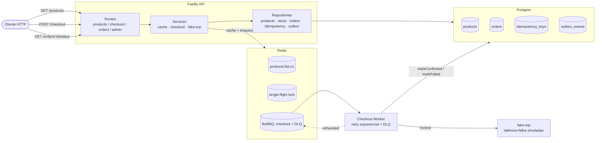

# CaseCellShop — Desafio Senior Backend

Solução de referência para o desafio técnico **CaseCellShop**, modelando um e-commerce em hipercrescimento acoplado a um ERP legado lento.

> **Parte 1.A — respostas conceituais consolidadas em PDF:** [`Respostas-CaseCellShop.pdf`](./Respostas-CaseCellShop.pdf) (também disponível em markdown formatado em [`docs/RESPOSTAS.md`](./docs/RESPOSTAS.md)).
> **Parte 1.B — mini-tarefa prática:** este repositório.

A solução endereça os 3 problemas do enunciado:

| # | Problema do enunciado | Como esta solução resolve |
|---|---|---|
| 1 | Vitrine lenta (cada acesso vai ao ERP) | **Cache-aside no Redis com TTL + single-flight lock** (`GET /products`) — anti-stampede via Redis `SET NX` + Lua script + jitter no TTL. |
| 2 | Overselling | **Reserva atômica condicional** (`UPDATE ... WHERE stock >= qty`) + **rollback de tx em pedidos multi-item** + tabela de **idempotência** com hash do payload. |
| 3 | Checkout síncrono frágil | **Outbox + fila + worker async**: `202 Accepted` retorna em ms; worker chama ERP simulado com **retry exponencial + jitter + DLQ**; status consultável via `GET /orders/:id/status`. |

> A discussão arquitetural completa (causa raiz, comparativos, arquitetura alvo 30-90 dias, SLI/SLO, runbooks) está em [`docs/RESPOSTAS.md`](./docs/RESPOSTAS.md). Este README foca em **como rodar e verificar**.

---

## Arquitetura implementada



**Observabilidade já integrada ao fluxo:**
- Logs JSON com `correlationId` propagado automaticamente em todos os logs do request (Pino + child logger).
- 18 métricas Prometheus (`/metrics`).
- Spans OpenTelemetry com **W3C Trace Context propagado para o worker via BullMQ** — o trace do `POST /checkout` continua dentro do worker assíncrono no mesmo `traceId`.

---

## Como rodar

**Pré-requisitos:** Node.js ≥ 20, pnpm, Docker Desktop.

```powershell
# 1. infra
docker compose up -d                # Redis + Postgres com healthchecks

# 2. dependências e schema (em api/)
cd api
pnpm install
pnpm migrate                        # cria 4 tabelas
pnpm seed                           # 9 capinhas (1 com stock=1 para testar concorrência)

# 3. processos (em terminais separados)
pnpm dev                            # API em http://localhost:3000
pnpm worker                         # consumidor da fila checkout

# 4. testes
pnpm test                           # 15 testes passam em ~7s
```

Endpoints úteis:
- API: http://localhost:3000 (Swagger UI em `/docs`, métricas em `/metrics`)
- Worker: http://localhost:3001 (métricas em `/metrics`, health em `/health`)

> Cada processo expõe seu próprio `/metrics` — em produção, o Prometheus tem dois scrape targets. O API mede o lado síncrono (cache, idempotência, http) e o worker mede o lado assíncrono (ERP, retries, checkout completion).

---

## Endpoints (cURL)

### GET /products
```bash
curl -i http://localhost:3000/products
# Response: 200 OK
# X-Cache: MISS  (primeira vez)
# [{"sku":"CAP-IP15-CLR","name":"...","price":49.90,"available":120}, ...]

curl -i http://localhost:3000/products
# X-Cache: HIT   (TTL 30s, dentro da janela)
```

### POST /checkout
```bash
curl -i -X POST http://localhost:3000/checkout \
  -H "Content-Type: application/json" \
  -H "Idempotency-Key: $(uuidgen)" \
  -d '{"items":[{"sku":"CAP-IP15-CLR","quantity":2}]}'
# Response: 202 Accepted
# {"orderId":"3315b86f-...", "status":"pending"}
```

Replay (mesma key, mesmo payload):
```bash
# Mesma resposta + header X-Idempotent-Replay: true
# Estoque NÃO decrementa duas vezes.
```

Conflito de estoque:
```bash
# Response: 409 Conflict
# {"code":"insufficient_stock","message":"cannot fulfill sku ...","sku":"..."}
```

### GET /orders/:orderId/status
```bash
curl http://localhost:3000/orders/3315b86f-e394-414c-91d1-4eadb596267d/status
# {"orderId":"...","status":"confirmed","erpInvoiceId":"inv_3315b86f_...","failedReason":null}
```

### GET /admin/dlq
```bash
curl http://localhost:3000/admin/dlq
# {"queue":"checkout-dlq","size":1,"items":[{"id":"1","timestamp":...,
#   "data":{"original":{...},"failedReason":"ERP_TRANSIENT_ERROR","attempts":5,
#   "_otel":{"traceparent":"00-aef60137899ca7bcdf5b1ff0a0000ded-..."}}}]}
```

---

## Testes — bateria automatizada

```bash
pnpm test
```

> A bateria roda contra o mesmo Postgres + Redis (compose). Cada `beforeEach` faz `fullReset` para isolamento; após a suíte, um `globalTeardown` restaura o catálogo canônico de 9 SKUs no DB, então `GET /products` continua exibindo o catálogo logo após `pnpm test` (sem precisar re-seedar).

Saída esperada (resumida):
```
✓ tests/concurrency.test.ts  (2 tests)
  ✓ apenas 1 de 50 requests concorrentes ganha o último item    316ms
  ✓ multi-item: rollback restaura decrementos parciais          ~50ms
✓ tests/idempotency.test.ts  (4 tests)
  ✓ replay com mesma key retorna mesmo orderId e NÃO decrementa duas vezes
  ✓ mesma key com payload diferente retorna 422
  ✓ Idempotency-Key inválido retorna 400
  ✓ hash insensitive à ordem dos items
✓ tests/cache.test.ts        (2 tests)
  ✓ primeira chamada MISS, segunda HIT, expira após TTL
  ✓ 20 requests concorrentes num miss disparam o loader 1× só
✓ tests/smoke.test.ts        (7 tests)

Test Files  4 passed (4)
     Tests  15 passed (15)
  Duration  ~7s
```

**Invariantes provadas pelos testes:**

| Invariante | Onde |
|---|---|
| `sum(decrements) == sum(orders confirmed * qty)` (anti-overselling) | `concurrency.test.ts` |
| Tx atômica em multi-item: ou tudo ou nada | `concurrency.test.ts` |
| Mesma idempotency-key + mesmo payload → mesma resposta + estoque -1× | `idempotency.test.ts` |
| Mesma key + payload diferente → 422 com `code: idempotency_key_reused_with_different_payload` | `idempotency.test.ts` |
| Cache single-flight: N requests concorrentes num miss invocam o loader **1×** | `cache.test.ts` |
| Cache expira após TTL | `cache.test.ts` |
| Job enfileirado com `jobId = orderId` (idempotência no enqueue) | `smoke.test.ts` |

---

## Observabilidade — exemplos prontos

### Estrutura de log
```json
{
  "level": "info",
  "time": "2026-05-26T12:48:13.523Z",
  "service": "casecellshop-api",
  "env": "development",
  "correlationId": "a4b92c67-689e-4d3c-9dd6-00bc8eaa61c4",
  "idempotencyKey": "e3dba625-c48b-4d34-8497-6b070be99924",
  "orderId": "3315b86f-e394-414c-91d1-4eadb596267d",
  "queue": "checkout",
  "msg": "checkout accepted"
}
```

### Trace ponta-a-ponta (validado)

Um único `POST /checkout` produz os seguintes spans, **todos com o mesmo `traceId`**:

```
[API]    checkout.process
         ├── idempotency.claim          attrs: idempotency.outcome
         ├── checkout.tx                attrs: order.id
         │   ├── stock.reserve          attrs: stock.failed_sku (se falhou)
         │   ├── (insertOrder, insertOutbox, completeIdempotency — auto via PgInstrumentation)
         └── queue.enqueue              attrs: queue.name

[WORKER] worker.process                 attrs: queue.attempt
         ├── erp.invoice                attrs: erp.invoice_id
         └── orders.mark_confirmed
```

O `traceparent` W3C é injetado no payload do job. Em produção, com exporter pra Datadog/Jaeger/Tempo, aparece como **um trace contínuo** atravessando o limite assíncrono.

### Métricas customizadas expostas em `/metrics`

```
cache_hits_total{key_prefix="products:list"}            # counter
cache_misses_total{key_prefix="products:list"}          # counter
cache_lock_wait_seconds_bucket{key_prefix=...}          # histogram
cache_value_age_seconds_bucket{key_prefix=...}          # histogram
checkout_started_total                                   # counter
checkout_completed_total{outcome="confirmed|failed"}    # counter
checkout_duration_seconds_bucket{phase="reserve_stock|enqueue|erp_call|worker"} # histogram
checkout_idempotency_replays_total                       # counter
stock_reserve_conflicts_total{sku=...}                   # counter
queue_jobs_waiting{queue="checkout"}                     # gauge
queue_jobs_active{queue="checkout"}                      # gauge
queue_jobs_failed_total{queue=...,reason=...}            # counter
queue_retry_total{queue=...}                             # counter
dlq_size{queue="checkout"}                               # gauge
erp_request_duration_seconds_bucket{endpoint,status}     # histogram
erp_errors_total{endpoint,code}                          # counter
http_request_duration_seconds_bucket{method,route,status_code} # histogram
```

### Dashboard (Datadog-like, conceitual)

```
┌──────────────────────────────────────────────────────────────────────┐
│ ROW 1 · Saúde geral                                                  │
│  [latência p50/95/99 por rota]   [erro rate]   [throughput]          │
├──────────────────────────────────────────────────────────────────────┤
│ ROW 2 · Cache                                                        │
│  [hit ratio]   [lock_wait p95]   [value_age dist]   [origin reqs]    │
├──────────────────────────────────────────────────────────────────────┤
│ ROW 3 · Checkout funnel                                              │
│  [started → reserved → enqueued → confirmed → failed]                │
│  [idempotency_replays]   [stock_reserve_conflicts]                   │
├──────────────────────────────────────────────────────────────────────┤
│ ROW 4 · Fila + Worker                                                │
│  [waiting]   [active]   [failed]   [dlq_size]   [job_duration]       │
├──────────────────────────────────────────────────────────────────────┤
│ ROW 5 · ERP                                                          │
│  [erp_latency]   [erp_errors]   [circuit_breaker]   [sync_lag]       │
└──────────────────────────────────────────────────────────────────────┘
```

### Alertas (Datadog-like, YAML conceitual)

```yaml
- name: dlq_growing
  condition: max(last_5m):dlq_size{queue:checkout} > 0
  severity: page
  reason: jobs esgotaram retries; risco de pedidos perdidos

- name: checkout_failure_burn
  condition: sum(last_15m):checkout_completed_total{outcome:failed}
             / sum(last_15m):checkout_started_total > 0.02
  severity: page
  reason: taxa de falha do checkout > 2% (SLO 99.5%)

- name: cache_hit_ratio_low
  condition: avg(last_15m):cache_hits_total
             / (cache_hits_total + cache_misses_total) < 0.7
  severity: warning
  reason: cache inefetivo — investigar invalidação massiva ou Redis fora

- name: p95_products_high
  condition: avg(last_10m):p95:http_request_duration_seconds{route:/products} > 0.5
  severity: warning
  reason: degradação na vitrine
```

### Runbook — "DLQ está crescendo"

> Primeira ação quando o alerta `dlq_growing` dispara.

1. **Inspecionar** payload da DLQ:
   ```bash
   curl http://localhost:3000/admin/dlq?limit=10 | jq .
   ```
   Cada item traz `data.original` (job), `failedReason` e `traceparent` para correlação com o request original.

2. **Classificar** a causa pelo `failedReason`:
   - `ERP_TRANSIENT_ERROR` repetido → checar saúde do ERP, abrir incidente com time do ERP.
   - Erro de validação ou contrato (4xx semântico) → bug nosso, **NÃO reprocessar** até deploy do fix.
   - Erro novo/desconhecido → escalar.

3. **Reprocessar** (após root-cause fix) — script para BullMQ:
   ```bash
   # Exemplo: pegar todos da DLQ e reenviar para a fila principal
   redis-cli LLEN bull:checkout-dlq:wait
   # Manual: ler payload, despushar e enviar com checkoutQueue.add(...)
   # Em produção implementaríamos `pnpm dlq:replay --max=N` como CLI.
   ```

4. **Comunicar**: `#incidents-checkout` no Slack; status page se > 100 pedidos afetados.

5. **Post-mortem** obrigatório se incidente passar de 30min.

---

## Critérios de avaliação → onde estão no código

| Critério (página 1 do PDF) | Evidência |
|---|---|
| **Análise de causa raiz, riscos e trade-offs** | [`docs/RESPOSTAS.md`](./docs/RESPOSTAS.md) — Pergunta 1 |
| **Cache: TTL, invalidação, fallback, cache stampede** | [`api/src/services/cache.ts`](./api/src/services/cache.ts) (single-flight + jitter + Lua release) · [`docs/RESPOSTAS.md`](./docs/RESPOSTAS.md) P2 |
| **Observabilidade: logs, métricas, traces, SLO, alertas, runbooks** | [`api/src/observability/`](./api/src/observability/) (logger, metrics, tracing, correlation) · runbook acima · [`docs/RESPOSTAS.md`](./docs/RESPOSTAS.md) P3 |
| **Consistência, idempotência e concorrência no checkout** | [`api/src/repositories/stock.ts`](./api/src/repositories/stock.ts) (atomic UPDATE) · [`api/src/services/checkout.ts`](./api/src/services/checkout.ts) (idempotency + tx + rollback) · [`api/tests/concurrency.test.ts`](./api/tests/concurrency.test.ts) · [`api/tests/idempotency.test.ts`](./api/tests/idempotency.test.ts) |
| **Resiliência assíncrona: retry, DLQ, reconciliação** | [`api/src/workers/checkout-worker.ts`](./api/src/workers/checkout-worker.ts) (retry exponencial + push DLQ) · [`api/src/routes/admin.ts`](./api/src/routes/admin.ts) (inspeção DLQ) · [`docs/RESPOSTAS.md`](./docs/RESPOSTAS.md) P5 (outbox + reconciler) |
| **Testes, contrato de API** | 15 testes Vitest em [`api/tests/`](./api/tests/) · [`openapi.yaml`](./openapi.yaml) sincronizado com a implementação real |
| **Uso responsável de IA** | [`PROMPTS.md`](./PROMPTS.md) — sessões reais com prompts, decisões descartadas e o bug encontrado nos testes |

---

## Trade-offs e simplificações

| Tópico | Decisão e por quê |
|---|---|
| **Outbox publisher real** | Tabela `outbox_events` está implementada e populada na mesma tx do pedido. Mas o publisher dedicado que reprocessa eventos `pending` quando a fila volta não está implementado — o enqueue acontece pós-commit diretamente. Em produção, um publisher daemon completaria a garantia de "no message lost" mesmo se Redis cair entre o commit e o enqueue. |
| **Reconciliador periódico** | Discutido em `RESPOSTAS.md` P5; não implementado. Cobre o caso "ERP faturou mas worker silenciosamente falhou ao atualizar". Em produção, cron horário consultando `WHERE status='pending' AND created_at < now() - interval '15m'`. |
| **Auth nos endpoints admin** | `/admin/dlq` está aberto — em produção, requer JWT/apiKey com escopo `admin`. |
| **CDC do ERP** | Sync de catálogo do ERP é fora do escopo do desafio (focado em "loja"). Em produção, Debezium ou polling incremental popularia `products` continuamente. |
| **Validação de schema da resposta** | Fastify valida `request body` via Zod e schemas inline. Validação de **response** contra o OpenAPI fica como reforço de CI (`spectral lint`). |
| **OpenTelemetry com console exporter** | Para o desafio é suficiente; em produção apontaria pra Datadog Agent / OTLP collector / Tempo. `OTEL_ENABLED=false` em testes para output limpo. |
| **Banco compartilhado em testes** | Vitest roda sequencial (`fileParallelism: false`) e cada `beforeEach` faz `fullReset` (truncate + flush cache + obliterate queues). Em CI usaríamos `testcontainers` ou schemas paralelos. |
| **Sem autenticação no /checkout** | Fora do escopo. Em produção: JWT do usuário no header `Authorization`. |

---

## Estrutura do repositório

```
case-cellshop/
├── README.md                    ← você está aqui
├── PROMPTS.md                   ← uso de IA + sessões reais
├── openapi.yaml                 ← contrato sincronizado com a implementação
├── docker-compose.yml           ← Redis + Postgres
├── docs/
│   └── RESPOSTAS.md             ← respostas conceituais (Parte 1.A)
└── api/
    ├── package.json
    ├── tsconfig.json
    ├── vitest.config.ts
    ├── .env.example
    ├── src/
    │   ├── server.ts            ← boot + graceful shutdown
    │   ├── app.ts               ← Fastify factory (testável)
    │   ├── config/env.ts        ← Zod validation
    │   ├── observability/       ← logger, metrics, tracing, correlation
    │   ├── infra/               ← db (withTx), redis, queue (BullMQ)
    │   ├── repositories/        ← products, stock (reserveStockTx), orders, idempotency, outbox
    │   ├── services/            ← cache (single-flight), products, checkout, fake-erp, orders
    │   ├── routes/              ← products, checkout, orders, admin, health, metrics
    │   ├── workers/             ← checkout-worker (retry + DLQ)
    │   └── scripts/             ← migrate, seed
    └── tests/
        ├── setup.ts             ← envs antes de qualquer import
        ├── helpers.ts           ← fullReset, seedProduct, newApp
        ├── concurrency.test.ts  ← anti-overselling + rollback multi-item
        ├── idempotency.test.ts  ← replay, hash mismatch, ordering insensitive
        ├── cache.test.ts        ← HIT/MISS/TTL + single-flight
        └── smoke.test.ts        ← /health, /metrics, todas as rotas
```

---

## Stack

| Camada | Escolha |
|---|---|
| Linguagem | **Node.js 22 + TypeScript 5** |
| HTTP | **Fastify 5** (mais leve que Express, hooks robustos, schemas nativos) |
| Validação | **Zod** (request body) + **schemas Fastify** (response) |
| Cache + fila | **Redis 7** + **BullMQ 5** |
| Banco | **Postgres 16** (autonomia da loja) |
| Logs | **Pino** (JSON estruturado, child loggers) |
| Métricas | **prom-client** (Prometheus formato) |
| Traces | **OpenTelemetry SDK** + auto-instrumentação (Fastify, HTTP, pg, ioredis) |
| Testes | **Vitest** (mesmo loader que tsx, ESM nativo) |
| Tooling | **pnpm**, **tsx watch**, Docker Compose |
