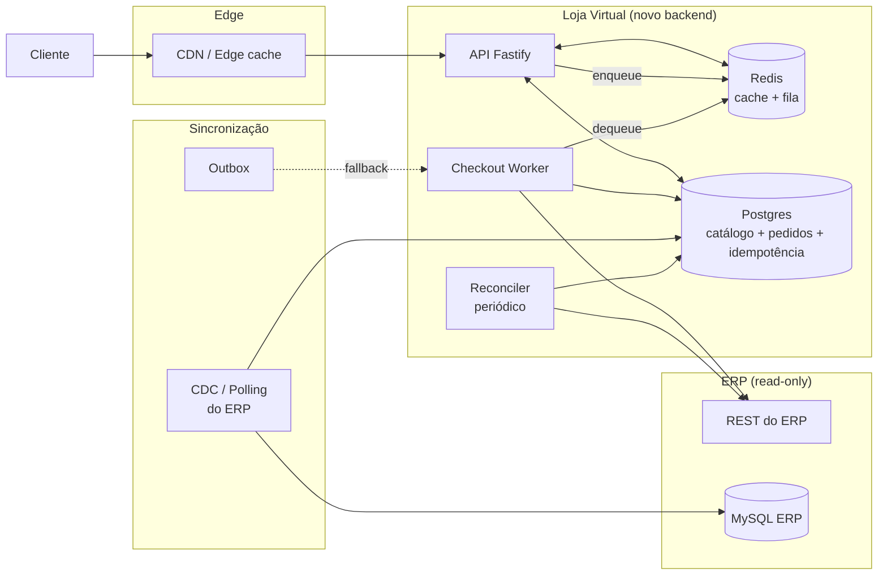
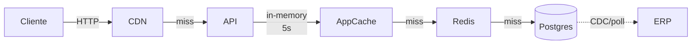
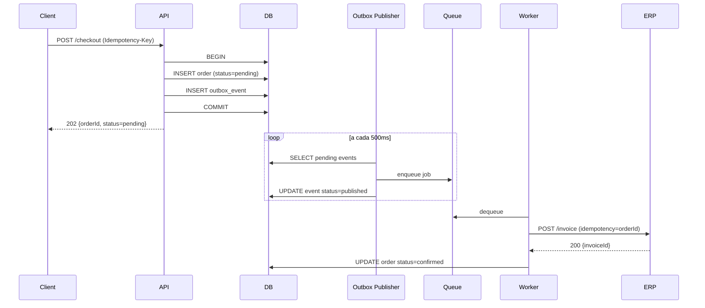

# Parte 1.A — Respostas Conceituais

> Documento de respostas às 5 perguntas conceituais do desafio CaseCellShop.
> A mini-tarefa prática (Parte 1.B) está implementada em [`../api/`](../api/) e exemplifica boa parte das decisões abaixo.

## Sumário

- [Pergunta 1 — Diagnóstico, trade-offs e arquitetura alvo](#pergunta-1--diagnóstico-trade-offs-e-arquitetura-alvo)
- [Pergunta 2 — Cache, invalidação e performance da vitrine](#pergunta-2--cache-invalidação-e-performance-da-vitrine)
- [Pergunta 3 — Observabilidade](#pergunta-3--observabilidade)
- [Pergunta 4 — Concorrência, estoque e idempotência](#pergunta-4--concorrência-estoque-e-idempotência)
- [Pergunta 5 — Mensageria, resiliência, contrato e IA](#pergunta-5--mensageria-resiliência-contrato-e-ia)

---

## Pergunta 1 — Diagnóstico, trade-offs e arquitetura alvo

### Premissa comum aos três problemas

O sintoma de fundo é o mesmo: **o ERP é o caminho síncrono crítico de todas as jornadas**. Ele foi feito para operação interna (faturamento, contábil, financeiro) e está sendo usado como *backend de leitura e escrita em tempo real* para uma vitrine pública. Isso viola três princípios:

1. **Acoplamento síncrono** entre canal de venda e sistema de retaguarda.
2. **Compartilhamento de carga OLTP transacional com leitura intensiva** de catálogo.
3. **Sem desacoplamento temporal** entre "cliente clicou em comprar" e "ERP faturou".

Os três problemas listados são manifestações específicas dessa premissa.

---

### Problema 1 — Performance da vitrine

#### Causa raiz
A vitrine consulta o ERP a cada acesso. O ERP é um **monolito MySQL com workload misto** (faturamento, contábil, financeiro). Cada `GET /products` da loja:

- Atravessa rede + LB + API REST do ERP.
- Disputa CPU e I/O do MySQL com transações de faturamento.
- Não tem nenhuma camada de cache no caminho.

A latência é função do **percentil pior do ERP**, que cresce não-linearmente com a carga (lock contention, buffer pool pressure, query plan degradation). Não é "a vitrine está lenta" — é "a vitrine está acoplada a um sistema que nunca foi projetado para ser hot-path de e-commerce".

#### Impacto
| Stakeholder | Impacto |
|-------------|---------|
| Cliente | Conversão cai (cada 100ms a mais ≈ -1% conversão em e-commerce); abandono de carrinho aumenta. |
| Negócio | Receita perdida diretamente proporcional à latência; CAC desperdiçado (paguei tráfego que não converteu). |
| Operação | Picos sazonais (Black Friday, lançamento de modelo) viram incidentes; ERP fica lento para o faturamento *interno* também — o time financeiro reclama. |

#### Alternativas

| Caminho | Latência | Consistência | Custo | Complexidade | Esforço operacional |
|---------|----------|--------------|-------|--------------|---------------------|
| **A. Cache distribuído na loja (Redis), cache-aside com TTL curto** | ⬇️⬇️⬇️ p95 < 50ms | Eventual, janela = TTL | Baixo | Baixa | Baixa |
| **B. Banco próprio da loja (read replica replicada do ERP via CDC)** | ⬇️⬇️ p95 < 100ms | Eventual, lag de CDC | Médio (storage + CDC pipeline) | Média | Média (precisa monitorar lag) |
| **C. Manter síncrono + escalar ERP vertical/horizontal** | ⬇️ marginal | Forte | Alto (licenças, hardware) | Alta (mexer no monolito é arriscado) | Alta — não resolve a causa raiz |

**Escolha:** **A combinada com B**. Cache (A) entrega o ganho imediato em dias. Banco próprio (B) resolve estruturalmente em semanas e habilita features que cache não consegue (busca facetada, filtros, ranking). C é descartado — alocar mais hardware num ERP transacional para servir leituras de vitrine é otimização errada.

---

### Problema 2 — Consistência de estoque (overselling)

#### Causa raiz
O cliente decrementa estoque via padrão **"ler → validar → escrever"**, que numa API REST síncrona sem garantia transacional é uma **race condition clássica**:

```
T1: GET /stock?sku=X → 1
T2: GET /stock?sku=X → 1
T1: POST /reserve → OK
T2: POST /reserve → OK   ← furo
```

Mesmo se o ERP tiver lock interno, a *janela* entre leitura na vitrine e escrita no ERP é arbitrária, e múltiplas réplicas/instâncias da loja não compartilham estado. Cache piora isso: o estoque exibido pode estar 30s velho, e o cliente clica em "comprar" baseado em informação desatualizada.

#### Impacto
| Stakeholder | Impacto |
|-------------|---------|
| Cliente | Recebe confirmação de pedido e depois descobre que não há produto → quebra de confiança, NPS despenca. |
| Negócio | Custo de cancelamento, reembolso, chargeback; risco regulatório (Procon, propaganda enganosa). |
| Operação | Atendimento sobrecarregado; ajustes manuais de estoque; ERP fica inconsistente com loja. |

#### Alternativas

| Estratégia | Garantia | Custo | Complexidade | Quando usar |
|------------|----------|-------|--------------|-------------|
| **Atomic conditional update** (`UPDATE ... WHERE stock >= qty`) | Forte no DB local da loja | Baixo | Baixa | Default — funciona em 99% dos casos |
| **Pessimistic lock** (`SELECT ... FOR UPDATE`) | Forte | Médio (lock contention) | Média | Quando há cálculos complexos entre leitura e escrita |
| **Reserva com TTL** (estoque "hold" expirável) | Forte + UX melhor | Médio | Média | Quando checkout demora (multi-step, pagamento) — libera estoque se cliente abandonar |
| **Distributed lock** (Redis Redlock) | Forte se bem feito | Médio-alto | **Alta** (fencing tokens, clock skew, split-brain) | Apenas quando o recurso não pode ser modelado como linha de DB |

**Escolha:** **Atomic conditional update + reserva com TTL**. O update atômico (`UPDATE products SET stock = stock - $qty WHERE sku = $sku AND stock >= $qty`) entrega a garantia mais simples e mais barata. A reserva com TTL é adicionada quando o fluxo tiver pagamento (não é o caso aqui, mas a arquitetura prepara). Distributed lock é descartado por padrão — ele é uma resposta a "não tenho um banco transacional", mas nós teremos.

#### Por que isso precisa do banco próprio da loja
Não dá pra fazer atomic update no ERP (acesso é só leitura). Logo, **a loja precisa ser a dona do "estoque comercializável"** — um espelho do ERP, sincronizado, mas com autoridade sobre as reservas. O ERP continua dono do "estoque físico" e do faturamento.

---

### Problema 3 — Resiliência do checkout

#### Causa raiz
O checkout é **síncrono fim-a-fim com o ERP**. A API do ERP demora para faturar (segundos a minutos em picos). Acoplamento síncrono significa:

- Timeout do cliente ≠ timeout do ERP → cliente acha que falhou, mas ERP fatura → pedido duplicado.
- Falha de rede no meio → cliente acha que falhou, ERP não recebeu → pedido perdido.
- Pico de tráfego → fila de requisições estoura → todos os pedidos travam.

O problema **não é a velocidade do ERP** (ela não vai mudar tão cedo), é a **expectativa de que ela seja síncrona**.

#### Impacto
| Stakeholder | Impacto |
|-------------|---------|
| Cliente | Não sabe se comprou; clica de novo; recebe cobrança duplicada ou nada. |
| Negócio | Receita perdida + custo de reconciliação manual; reputação. |
| Operação | Reconciliação de pedidos "ERP fatuou mas loja não confirmou" vira processo recorrente; ninguém confia no painel. |

#### Alternativas

| Caminho | Latência percebida | Resiliência | Complexidade |
|---------|--------------------|-------------|--------------|
| **A. Manter síncrono com timeout maior + retry no cliente** | ⬆️ alta | Baixa (timeout + retry = pedido fantasma) | Baixa |
| **B. Async com fila + worker + idempotência + outbox** | ⬇️ baixa (responde 202) | Alta | Média |
| **C. Saga distribuída (com compensação)** | ⬇️ baixa | Alta | **Alta** (compensações são difíceis de testar) |

**Escolha:** **B — Async com outbox + idempotência**. O cliente recebe `202 Accepted` com `orderId`. Um worker assume a responsabilidade de "fazer o ERP faturar" com retry/backoff/DLQ. Reconciliação periódica pega os casos onde o worker desistiu. Saga (C) seria overkill — não temos múltiplos serviços competindo pela transação, temos um único ERP.

---

### Arquitetura alvo (30–90 dias)



**Componentes e papéis:**

| Componente | Papel | Janela |
|------------|-------|--------|
| **CDN / edge cache** | Cache de página estática + catálogo público de baixa cardinalidade (lista geral). TTL longo (5–10min). | 0–30 dias |
| **Cache Redis (loja)** | Cache-aside de respostas de `/products`. TTL curto (30s). | 0–15 dias |
| **Postgres da loja** | Catálogo replicado + pedidos + tabela de idempotência + outbox. Dono do estoque comercializável. | 15–60 dias |
| **Fila (BullMQ no Redis)** | Desacopla checkout do ERP. Retry com backoff + DLQ. | 0–30 dias |
| **Checkout worker** | Consome fila, chama ERP, atualiza status do pedido. Idempotente. | 0–30 dias |
| **Reconciler periódico** | Cron horário. Pega pedidos `pending` há > X minutos e bate com ERP para resolver. | 30–60 dias |
| **CDC / sync de catálogo** | Replica produto/preço/estoque do ERP para a loja. Estratégia: polling incremental no início, CDC (Debezium) depois. | 30–90 dias |
| **Outbox pattern** | Tabela `outbox_events` gravada na mesma transação do pedido; um publisher lê e enfileira. Garante "no message lost". | 30–60 dias |
| **Observabilidade** | Logs estruturados (Pino), métricas (Prometheus/Datadog), traces (OTel). SLOs por jornada. | 0–30 dias (incremental) |

**Princípio orientador:** **a loja deixa de ser cliente do ERP e vira um sistema autônomo** que se sincroniza com o ERP. O ERP volta a ser o que sempre foi: sistema de retaguarda.

---

## Pergunta 2 — Cache, invalidação e performance da vitrine

### Onde colocar cache — visão em camadas



| Camada | Tipo | TTL típico | Papel |
|--------|------|------------|-------|
| **CDN/edge** | HTTP cache (Cache-Control) | 5–10min para listas anônimas | Absorve picos virais; serve a maior parte do tráfego anônimo sem chegar na API. |
| **In-memory na app (Node)** | LRU ou simples Map | 5s | Elimina round-trip ao Redis em loops curtos (mesmo SKU consultado dezenas de vezes no mesmo segundo). Cuidado: stale cresce N×instâncias. |
| **Redis (cache-aside)** | Distribuído | 30s | Camada principal — compartilhada entre instâncias. |
| **Postgres da loja** | Source-of-truth local | — | Já é a "réplica" do ERP. Cache mira aqui em caso de miss. |

> **Não é só "ligar o cache"**. Cada camada tem um perfil de invalidação e um custo de "stale" diferente. CDN errado = catálogo errado por minutos para milhões. App-cache errado = inconsistência entre instâncias. Redis errado = thundering herd.

### Estratégias

#### TTL por tipo de dado
- **Catálogo (nome, imagem, descrição):** TTL longo (10–30min). Muda raramente.
- **Preço:** TTL médio (1–5min). Muda com campanhas.
- **Estoque (disponibilidade booleana):** TTL curto (10–30s). Muda a cada compra.

**Decisão importante:** *separar a chave de cache por domínio.* `cache:product:meta:{sku}` vs `cache:product:price:{sku}` vs `cache:product:availability:{sku}`. Assim invalidar preço não joga fora o blob de catálogo todo.

#### Padrões de leitura

| Padrão | Funcionamento | Quando usar |
|--------|---------------|-------------|
| **Cache-aside (lazy)** | App lê cache; se miss, busca DB e popula. | **Default.** Simples, robusto. |
| **Refresh-ahead** | Job background renova a chave antes de expirar. | Chaves quentíssimas onde miss é inaceitável (homepage). |
| **Write-through** | Toda escrita atualiza cache + DB. | Quando escrita é frequente e leitura precisa ser sempre fresca. Não aplicável aqui (escrita vem do CDC do ERP). |

#### Invalidação
- **Por TTL (passive):** simples, sempre tem um teto de staleness.
- **Por evento (active):** quando o sync do ERP detecta mudança de preço/estoque, publica evento e a app invalida a chave (`DEL cache:product:price:{sku}`). Combina com TTL como rede de segurança.
- **Por versão:** chave inclui versão do dado (`cache:product:{sku}:v{version}`). Mudar versão "invalida" sem operação de DELETE — útil em bulk invalidation.

#### Fallback
- **Stale-if-error:** se a fonte de origem falhar (Postgres offline), serve a versão expirada do cache com header `X-Cache-Stale: true`. Catálogo velho > catálogo inexistente.
- **Default vazio coerente:** nunca retornar 500 para "lista de produtos" — retornar lista vazia + alerta para oncall é pior; retornar stale é melhor.

#### Prevenção de cache stampede
Quando uma chave quente expira, N requests simultâneas batem na origem ao mesmo tempo. Soluções, do mais simples ao mais sofisticado:

1. **Jitter no TTL:** TTL = base ± 10% aleatório. Espalha expirações.
2. **Single-flight (lock por chave):** primeira request que pega o miss adquire um lock Redis (`SET cache:lock:{key} NX EX 5`). Outras requests aguardam (com backoff curto) ou retornam stale. **Implementado na Parte 1.B.**
3. **Refresh-ahead com worker dedicado:** background job mantém chaves quentes sempre fresh — clientes nunca pegam miss.
4. **Probabilistic early expiration (XFetch):** com probabilidade crescente perto do TTL, uma request "se voluntaria" para renovar. Espalha o custo no tempo. Mais sofisticado, vale quando o stampede dói muito.

> Veja implementação em [`api/src/services/products.ts`](../api/src/services/products.ts) — usa cache-aside + single-flight lock + jitter.

### Métricas para validar ganho sem servir dado obsoleto

**Métricas de performance/custo:**
- `cache_hit_ratio = hits / (hits + misses)` — alvo: **> 0.9** para listas, **> 0.7** para preço.
- `http_request_duration_seconds{route="/products"}` (histogram) — comparar p50/p95/p99 antes/depois.
- `origin_requests_total` (counter) — deve **cair em ordem de magnitude** após cache.
- `cache_lock_wait_seconds` (histogram) — mede quanto requests aguardam no single-flight; pico indica stampede.

**Métricas de freshness (acuracidade):**
- `cache_value_age_seconds` (histogram) — quanto tempo desde que a chave foi populada quando foi servida. Distribuição deveria estar bem abaixo do TTL.
- `cache_staleness_violations_total` — contador incrementado quando uma comparação amostral (ver abaixo) revela diferença entre cache e fonte.
- `sync_lag_seconds` (gauge) — tempo desde o último sync bem-sucedido com o ERP. Stale aceitável depende dele.

**Comparação amostral periódica (canary read-through):**
A cada N minutos, um job pega K SKUs aleatórios e compara `valor_no_cache` vs `valor_na_fonte`. Discrepância → alerta. Isso protege contra "cache hit ratio está ótimo, mas estamos servindo lixo".

**Métricas de negócio (definitivas):**
- Taxa de conversão por sessão.
- Reclamações de "preço errado" / "produto sem estoque" por canal de atendimento.
- Tempo médio até "Adicionar ao carrinho" (proxy de UX).

> Cache não é só "está rápido" — é "está rápido **e** correto **e** o usuário compra mais". As três métricas precisam mover juntas para considerar a iniciativa bem-sucedida.

---

## Pergunta 3 — Observabilidade

### Logs estruturados

Formato: **JSON, uma linha por evento, sem texto livre concatenado.** Pino é o padrão em Node.

**Campos obrigatórios em todo log:**

| Campo | Tipo | Exemplo | Por quê |
|-------|------|---------|---------|
| `timestamp` | ISO 8601 | `2026-05-25T12:34:56.789Z` | Ordenação e correlação. |
| `level` | string | `info`, `warn`, `error` | Filtro padrão. |
| `service` | string | `casecellshop-api` | Multi-serviço. |
| `env` | string | `prod`, `staging` | Filtro. |
| `correlationId` / `requestId` | UUID | `0f3a...` | **O mais importante.** Conecta logs de múltiplos serviços. |
| `traceId` / `spanId` | hex | `8c91...` | Correlação com traces distribuídos. |
| `message` | string | `checkout.accepted` | Evento, não texto livre — facilita busca. |

**Campos contextuais (quando aplicável):**
- `route`, `method`, `statusCode`, `latencyMs` — em logs de HTTP.
- `orderId`, `customerId`, `sku`, `quantity` — em logs de domínio.
- `cacheKey`, `cacheStatus` (`hit|miss|stale`) — em logs de cache.
- `queueName`, `jobId`, `attempt`, `outcome` (`success|retry|dead`) — em logs de fila.
- `erpRequestId`, `erpStatusCode`, `erpLatencyMs` — em integrações externas.

**Regras:**
- **Nunca** logar `password`, `cvv`, `cpf` em texto cru. Mascarar.
- **Sempre** logar entrada e saída de operações de domínio críticas (checkout) com correlação.
- Erros: incluir `stack`, mas não duplicar a mensagem em dezenas de campos.

### Métricas (Prometheus / Datadog)

Convenção: nome em snake_case, sufixo de unidade quando aplicável (`_seconds`, `_bytes`, `_total`).

#### Cache
| Métrica | Tipo | Labels |
|---------|------|--------|
| `cache_hits_total` | counter | `key_prefix` |
| `cache_misses_total` | counter | `key_prefix` |
| `cache_lock_wait_seconds` | histogram | `key_prefix` |
| `cache_value_age_seconds` | histogram | `key_prefix` |

#### Checkout
| Métrica | Tipo | Labels |
|---------|------|--------|
| `checkout_started_total` | counter | — |
| `checkout_completed_total` | counter | `outcome` (`confirmed`/`failed`) |
| `checkout_duration_seconds` | histogram | `phase` (`reserve_stock`/`enqueue`/`worker`/`erp_call`) |
| `checkout_idempotency_replays_total` | counter | — |
| `stock_reserve_conflicts_total` | counter | — |

#### Fila
| Métrica | Tipo | Labels |
|---------|------|--------|
| `queue_jobs_waiting` | gauge | `queue` |
| `queue_jobs_active` | gauge | `queue` |
| `queue_jobs_failed_total` | counter | `queue`, `reason` |
| `queue_job_duration_seconds` | histogram | `queue` |
| `queue_retry_total` | counter | `queue` |
| `dlq_size` | gauge | `queue` |

#### ERP
| Métrica | Tipo | Labels |
|---------|------|--------|
| `erp_request_duration_seconds` | histogram | `endpoint`, `status` |
| `erp_errors_total` | counter | `endpoint`, `code` |
| `erp_circuit_breaker_state` | gauge | `endpoint` (0=closed, 1=open, 2=half) |

### Traces distribuídos

**Fluxo `GET /products`** (spans):
```
http.request (GET /products)
├── cache.get (key=products:list)
│   └── (HIT, done)
│   ─ ou ─
│   └── cache.lock.acquire (single-flight)
│       └── db.query (SELECT * FROM products)
│           └── cache.set
```

**Fluxo `POST /checkout`** (assíncrono):
```
http.request (POST /checkout)
├── idempotency.lookup
├── db.tx
│   ├── db.reserve_stock (UPDATE ... WHERE stock >= qty)
│   ├── db.insert_order
│   └── db.insert_outbox_event
└── queue.enqueue (checkout-job)
─────────────────────────────────────── (response 202)

worker.process (checkout-job)
├── erp.invoice (HTTP POST)
├── db.update_order_status
└── (sucesso) ou queue.retry / queue.dlq
```

**Por que `worker.process` é separado mas correlacionado:** o `traceId` é propagado via header/job metadata. No Datadog (ou equivalente), aparece como continuação do mesmo trace — o avaliador consegue clicar no pedido e ver o fluxo síncrono + assíncrono unificados.

**Atributos importantes nos spans:**
- `order.id`, `customer.id`, `sku`, `quantity`
- `idempotency.key`, `idempotency.outcome` (`new`/`replay`)
- `cache.status`, `cache.key`
- `queue.job_id`, `queue.attempt`
- `erp.invoice_id`, `erp.status_code`

### SLI / SLO / Alertas / Runbook

#### SLIs (Service Level Indicators)
| SLI | Definição |
|-----|-----------|
| **Disponibilidade `/products`** | (1 - erros 5xx / total) na janela |
| **Latência `/products`** | p95 < 300ms |
| **Disponibilidade `/checkout`** | (1 - erros 5xx / total) |
| **Taxa de sucesso de checkout** | `checkout_completed[outcome=confirmed] / checkout_started` |
| **Acuracidade do cache** | comparação amostral periódica (ver P2) |

#### SLOs (alvos)
| SLO | Alvo | Janela |
|-----|------|--------|
| Disponibilidade `/products` | ≥ 99.9% | 30 dias |
| Latência `/products` p95 | < 300ms | 30 dias |
| Disponibilidade `/checkout` (resposta 202) | ≥ 99.95% | 30 dias |
| Taxa de sucesso de checkout | ≥ 99.5% | 7 dias |

#### Error budget e alertas

Error budget = (1 - SLO) × tráfego. Alertas com **multi-window, multi-burn-rate** (Google SRE workbook):
- **Fast burn (2% do budget em 1h)** → page imediato.
- **Slow burn (10% em 6h)** → ticket / notificação não-acordável.

Alertas adicionais (lagging vs leading):
- `dlq_size > 0` por > 5min → page. Quase nunca deveria ter mensagem na DLQ.
- `sync_lag_seconds > 300` → warning (catálogo > 5min atrás do ERP).
- `cache_hit_ratio < 0.7` por 15min → warning (alguma coisa quebrou o cache).
- `erp_circuit_breaker_state == 1` → page (ERP está fora).
- `stock_reserve_conflicts_total` rate > 5/min → investigar (UI mostrando produto sem estoque?).

#### Dashboard (Datadog ou equivalente)

```
┌────────────────────────────────────────────────────────────────┐
│ Row 1: Saúde geral                                             │
│ [Latência p50/95/99] [Error rate] [Throughput]                 │
├────────────────────────────────────────────────────────────────┤
│ Row 2: Cache                                                   │
│ [Hit ratio] [Lock wait p95] [Value age dist] [Origin reqs]     │
├────────────────────────────────────────────────────────────────┤
│ Row 3: Checkout funnel                                         │
│ [Started → Reserved → Enqueued → Confirmed]                    │
│ [Idempotency replays] [Stock conflicts]                        │
├────────────────────────────────────────────────────────────────┤
│ Row 4: Fila + Worker                                           │
│ [Waiting] [Active] [Failed] [DLQ size] [Job duration]          │
├────────────────────────────────────────────────────────────────┤
│ Row 5: ERP                                                     │
│ [ERP latency] [ERP errors] [Circuit breaker] [Sync lag]        │
└────────────────────────────────────────────────────────────────┘
```

#### Runbook — exemplo: "DLQ está crescendo"

> Documento curto, acionável, com comandos prontos. Não é "documentação" — é "primeira hora de incidente".

```
ALERT: dlq_size > 0 sustained > 5min on queue=checkout

1. CHECAR: Datadog → dashboard "Checkout funnel".
   - O que correlaciona? Pico de tráfego? ERP fora?

2. INSPECIONAR mensagens da DLQ:
   redis-cli -h prod-redis LRANGE bull:checkout:failed 0 10

3. CLASSIFICAR causa:
   a) ERP 5xx persistente → abrir incidente com time do ERP. Manter mensagens na DLQ.
   b) Payload inválido (bug nosso) → ticket P1, NÃO reprocessar até fix deployed.
   c) Falha transitória (timeout) → reprocessar com:
      pnpm dlq:replay --queue=checkout --max=100

4. COMUNICAR: #incidents-checkout no Slack. Status page se > 100 pedidos afetados.

5. ENCERRAR: após DLQ zerar, abrir post-mortem se incidente passou de 30min.
```

---

## Pergunta 4 — Concorrência, estoque e idempotência

### Por que checagem simples é insuficiente

```js
// ANTI-PADRÃO — não fazer
const product = await db.query('SELECT stock FROM products WHERE sku=$1', [sku]);
if (product.stock >= qty) {
  await db.query('UPDATE products SET stock = stock - $1 WHERE sku=$2', [qty, sku]);
}
```

Problema: entre o `SELECT` e o `UPDATE`, qualquer outra request pode ler o mesmo `stock`. **Sem isolamento serializável, isso é uma race condition**. Aumentar isolamento para `SERIALIZABLE` resolveria, mas com custo enorme de retry/deadlock e contenção.

### Comparativo

#### 1. Atomic conditional update
```sql
UPDATE products
SET stock = stock - $qty
WHERE sku = $sku AND stock >= $qty
RETURNING stock;
```
A condição (`stock >= qty`) é avaliada **dentro da mesma operação atômica** que faz o write. Se duas requests competem, apenas uma vê `stock >= qty` antes de o outro decrementar.

| Prós | Contras |
|------|---------|
| Sem lock explícito; simples. | Só funciona quando a decisão se reduz a uma expressão SQL. |
| Performance ótima (sem contenção). | Cálculos mais complexos (ex.: estoque por canal + reservado + promoção) ficam difíceis no SQL. |
| Funciona em qualquer banco transacional. | — |

**Esta é a estratégia padrão.** Implementada em [`api/src/repositories/stock.ts`](../api/src/repositories/stock.ts).

#### 2. Pessimistic lock
```sql
BEGIN;
SELECT stock FROM products WHERE sku = $sku FOR UPDATE;
-- ... lógica de aplicação ...
UPDATE products SET stock = stock - $qty WHERE sku = $sku;
COMMIT;
```
| Prós | Contras |
|------|---------|
| Permite lógica arbitrária entre lock e write. | Lock contention pode ficar pesado em SKUs quentes. |
| Mais legível. | Risco de deadlock se múltiplas linhas forem locked em ordem inconsistente. |

Use quando precisar de cálculos não-triviais entre leitura e decisão.

#### 3. Reserva de estoque (com TTL)
Modelagem: separar `stock` em `available` e `reserved`. Reserva insere linha em `stock_reservations(sku, qty, expires_at)`. Estoque exibido = `stock.available - SUM(reservations.qty WHERE NOT expired)`.

| Prós | Contras |
|------|---------|
| UX melhor — cliente pode levar 5min para terminar checkout sem perder o item. | Complexidade: precisa de job que limpa reservas expiradas. |
| Anti-overselling natural. | Cálculos de disponibilidade ficam mais caros. |

Aplicável quando o fluxo de compra tem múltiplos passos lentos (carrinho persistido + pagamento + endereço). **Vou implementar como simulação na Parte 1.B**, mostrando a tabela mesmo que o fluxo seja mais simples.

#### 4. Distributed lock (Redlock)
```js
const lock = await redlock.acquire([`lock:sku:${sku}`], 5000);
try {
  // lógica
} finally { await lock.release(); }
```
| Prós | Contras |
|------|---------|
| Funciona quando o recurso não é uma linha de banco. | **Sem fencing token, há janelas de inconsistência** (clock skew, GC pause). |
| — | "Redlock is unsafe" — leitura clássica do Martin Kleppmann. Use só quando não há alternativa. |

**Descartado** para este caso — temos banco transacional.

### Idempotência — retry, duplo clique, reprocessamento

#### Mecanismo
1. Cliente envia header `Idempotency-Key: <uuid>` no `POST /checkout`.
2. API consulta tabela `idempotency_keys`:
   - Se existe e está completa → retorna a resposta original (mesmo `orderId`).
   - Se existe e está "em andamento" → retorna 409 (ou aguarda).
   - Se não existe → cria com status "in-progress", processa, persiste resposta + status "complete".
3. Chave expira em 24h (TTL configurável).

#### Schema da tabela
```sql
CREATE TABLE idempotency_keys (
  key            UUID PRIMARY KEY,
  request_hash   TEXT NOT NULL,  -- SHA256 do body, detecta mesma key com payload diferente
  order_id       UUID,
  status         TEXT NOT NULL CHECK (status IN ('in_progress','complete')),
  response_body  JSONB,
  response_code  INT,
  created_at     TIMESTAMPTZ DEFAULT now(),
  expires_at     TIMESTAMPTZ NOT NULL
);
```

Se `request_hash` da nova chamada não bate com o gravado → retornar `422` com `code: idempotency_key_reused_with_different_payload`. Esse erro é importante: protege o cliente contra bugs onde a key foi reusada acidentalmente.

#### Como combina com a reserva atômica
- A reserva (`UPDATE ... WHERE stock >= qty`) é executada **dentro da mesma transação** que insere o pedido E insere/atualiza o `idempotency_keys`. Tudo ou nada.
- Retries no cliente nunca duplicam decremento.
- Worker assíncrono também é idempotente por `orderId` — chamar ERP duas vezes é seguro porque o ERP recebe `external_reference = orderId`; se já existir, ERP retorna o fatura existente.

### Como testar que evita overselling

#### Teste de concorrência (implementado em Vitest)
```ts
it('apenas uma de N requests concorrentes ganha o último item', async () => {
  await seedProduct({ sku: 'CAP-1', stock: 1 });
  const requests = Array.from({ length: 50 }, () =>
    api.post('/checkout', { items: [{ sku: 'CAP-1', quantity: 1 }] },
      { headers: { 'Idempotency-Key': uuid() } })
  );
  const responses = await Promise.all(requests);
  const accepted = responses.filter(r => r.status === 202);
  const conflicts = responses.filter(r => r.status === 409);
  expect(accepted).toHaveLength(1);
  expect(conflicts).toHaveLength(49);
  const after = await db.query('SELECT stock FROM products WHERE sku=$1', ['CAP-1']);
  expect(after.rows[0].stock).toBe(0);
});
```

#### Teste de idempotência
```ts
it('mesma idempotency-key não decrementa estoque duas vezes', async () => {
  await seedProduct({ sku: 'CAP-1', stock: 5 });
  const key = uuid();
  const headers = { 'Idempotency-Key': key };
  const r1 = await api.post('/checkout', { items: [{ sku: 'CAP-1', quantity: 2 }] }, { headers });
  const r2 = await api.post('/checkout', { items: [{ sku: 'CAP-1', quantity: 2 }] }, { headers });
  expect(r1.data.orderId).toEqual(r2.data.orderId);
  const after = await db.query('SELECT stock FROM products WHERE sku=$1', ['CAP-1']);
  expect(after.rows[0].stock).toBe(3); // não 1
});
```

#### Teste de carga (fora do CI, manual com k6)
```js
// 1000 RPS por 60s contra /checkout com 100 SKUs (estoque inicial = 10 cada)
// Verificar que SOMA(decrements) == SOMA(stock_inicial - stock_final)
```

> Em produção, isso vira um *invariante monitorado*: `sum(checkout_completed[outcome=confirmed]) * avg(qty) == sum(stock_decrements)`. Se divergir, alarme.

---

## Pergunta 5 — Mensageria, resiliência, contrato e IA

### Publicar antes ou depois de gravar o pedido?

**Resposta curta:** publicar **depois** de gravar, mas garantir publicação via **outbox pattern**.

#### Cenário "publicar antes de gravar"
```
1. enqueue(job)        ✅
2. INSERT order        ❌ (crash, banco cai)
```
→ **Mensagem fantasma**: worker recebe job, tenta processar, mas o pedido não existe. Cliente nunca verá esse pedido.

#### Cenário "publicar depois de gravar" (ingênuo)
```
1. INSERT order        ✅
2. enqueue(job)        ❌ (Redis cai, network blip)
```
→ **Pedido fantasma**: pedido existe no banco, mas worker nunca foi acionado. Cliente vê "pending" para sempre.

#### Solução: Outbox Pattern

```
TRANSAÇÃO ÚNICA:
  INSERT INTO orders (...)
  INSERT INTO outbox_events (event_type='checkout_requested', payload, status='pending')
COMMIT;

(separadamente, um publisher dedicado)
  SELECT * FROM outbox_events WHERE status='pending' LIMIT 100;
  para cada → enqueue + UPDATE status='published';
```

**Por que isso resolve:**
- A escrita do pedido e a "intenção de publicar" são **atomicamente consistentes** (mesma transação no Postgres).
- O publisher é um processo **simples e idempotente** que pode falhar e reiniciar sem perder mensagens.
- Se a fila estiver fora, o evento fica em `outbox_events`. Quando volta, é publicado.
- "At-least-once delivery": a mensagem pode ser publicada mais de uma vez (raro), e o worker é idempotente para tolerar.

#### Diagrama


### Retry, DLQ e reconciliação

#### Política de retry
- **Backoff exponencial com jitter:** 1s, 2s, 4s, 8s, 16s, 32s (cap 60s).
- **Máximo 5 tentativas.** Depois → DLQ.
- **Idempotência no ERP:** worker envia `external_reference = orderId`; ERP retorna a mesma fatura se chamado de novo.
- **Erros não-retriáveis** (4xx semanticamente errados): vão direto para DLQ.

#### DLQ (Dead Letter Queue)
- Fila separada (`checkout-dlq`).
- **Métrica `dlq_size > 0` é alerta P1.**
- Mensagens contêm: payload original, lista de tentativas, último erro, timestamp.
- Operação tem comando `pnpm dlq:replay --max=N` para reprocessar após root-cause fix.

#### Reconciliação (rede de segurança)
Job que roda a cada hora:
```sql
SELECT order_id FROM orders
WHERE status = 'pending' AND created_at < now() - interval '15 minutes';
```
Para cada um:
- Consulta ERP: `GET /invoices?external_reference=<orderId>`.
- Se ERP **tem** a fatura → marca como `confirmed` (worker silenciosamente falhou em atualizar).
- Se ERP **não tem** → reenfileira ou move para DLQ com contexto.

Isso protege contra: bugs no worker, message loss, indisponibilidade prolongada do ERP. **Princípio:** *idempotência + observabilidade + reconciliação periódica = at-least-once + eventualmente correto*.

### Contrato (OpenAPI)

Princípios:
- **Schemas explícitos** para sucesso e erro (não apenas "200 ok").
- **Códigos de erro tipados** no payload: `{code: 'insufficient_stock', message: '...', details: {...}}`.
- **Headers como cidadãos de primeira classe**: `Idempotency-Key`, `X-Correlation-Id`, `X-Cache`.
- **Versionado**: `info.version` segue semver; quebras incrementam major + alias de path (`/v2/checkout`).

Veja [`../openapi.yaml`](../openapi.yaml) — contrato completo.

#### Testes baseados em contrato
- Validar requests/responses contra o schema (`ajv` ou similar) no setup dos testes.
- Em CI, lint do OpenAPI (Spectral).
- Garante que mudança quebrando o contrato falha o build, não a produção.

### Uso responsável de IA

Princípios para esta solução (registrados em [`../PROMPTS.md`](../PROMPTS.md)):

1. **IA como acelerador, não como autor.** Cada output revisado contra:
   - As restrições do case (ERP read-only, datacenter próprio).
   - Trade-offs explícitos: "por que essa solução e não a alternativa".
2. **Promptar com contexto, não com instruções soltas.** "Sugira retry para fila" é ruim. "Considerando BullMQ, ERP com janelas de indisponibilidade de até 5min, e SLO de 99.95%, qual a configuração de retry e DLQ adequada, com justificativa?" é melhor.
3. **Nunca aceitar código que não consigo defender em entrevista.** Se a IA usou um padrão que eu não consigo explicar (ex.: Redlock), ou descarto, ou estudo até dominar antes de adotar.
4. **Registrar prompts não-triviais.** Para auditoria, transparência e aprendizado. Decisões arquiteturais ficam registradas em `PROMPTS.md` com o raciocínio crítico aplicado.
5. **IA pra acelerar o que é mecânico** (boilerplate, OpenAPI YAML, exemplos de teste); **eu pra decidir o que importa** (trade-offs, modelagem, contratos públicos).

---

## Encerramento

A solução proposta endereça os três problemas do enunciado tratando-os como manifestações de um único anti-padrão arquitetural — **acoplamento síncrono com o ERP**. Cada decisão técnica (cache, banco próprio, idempotência, outbox, DLQ, reconciliação) atende a um modo de falha específico, observável por SLI/SLO, e tem fallback documentado em runbook.

A Parte 1.B implementa esta arquitetura em escala reduzida, com testes que comprovam invariantes críticas (anti-overselling, idempotência, cache stampede prevention).
